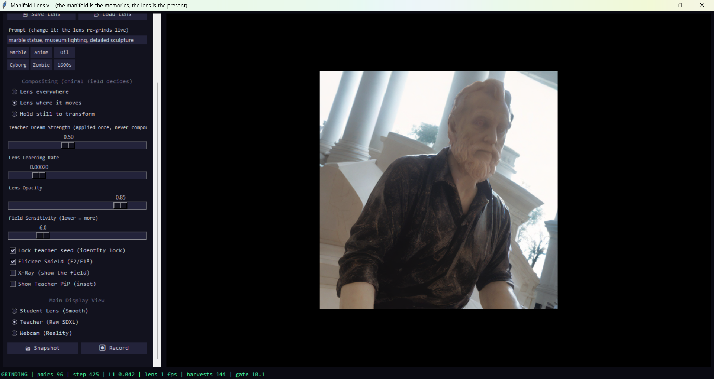

Here is a comprehensive, conceptually rich README.md tailored for your GitHub repository. It captures the deep mathematics, the practical workflow, and the philosophical "ethos" of the project we've built.

# **ManifoldLens**



**Very odd img2img / deepfake style creative webcam app.**  
*The manifold remembers. The lens sees.*  
**ManifoldLens** is a real-time AI webcam filter that solves the two fundamental flaws of traditional Stable Diffusion video feedback loops: **Cartoon Drift** and **Identity Flicker**.  
Instead of feeding AI-generated frames back into themselves (which causes the image to "boil" and collapse into generic cartoon attractors), ManifoldLens uses **Online Distillation**. It runs a heavy diffusion model (the Teacher) slowly in the background to hallucinate styles, while simultaneously training a tiny, hyper-fast U-Net (the Student Lens) to lock onto those hallucinations.  
The result is a temporally flawless, 30+ FPS stylized webcam feed that doesn't flicker, doesn't tear, and locks your exact physical geometry into the AI's "dream" manifold.

## **🧠 The Core Concepts**

### **The Problem**

If you run img2img on a live webcam feed:

1. **Identity Flicker:** Stable Diffusion is stochastic. It dreams a slightly different version of you every frame.  
2. **Cartoon Drift:** If you try to fix the flicker by feeding the last frame back into the model, you create a recursive contraction map. The model rapidly stylizes the image into a deep-fried cartoon.

### **The Cure: The "Third Manifold"**

ManifoldLens splits the roles:

* **The Teacher (SDXL-Turbo):** The "Memories." It looks *only* at your raw webcam. Using a locked seed, it generates high-quality stylized targets (e.g., "Marble Statue", "Cyborg") at a slow framerate.  
* **The Student (U-Net):** The "Present." A fast, deterministic neural network (\~6M parameters) that trains live to map your webcam directly to the Teacher's dreams. Because a U-Net is a fixed mathematical function, identical poses produce bit-identical outputs. **Zero flicker, zero drift.**  
* **The Chiral Field:** A zero-parameter, mathematically rigorous motion detector. It acts as the "cortex" gatekeeper, tracking your real-world temporal motion to tell the Teacher *when* to generate a new image (only when you move) and *where* to composite the results.

## **🚀 Features & Modes**

* **Live Online Distillation:** Watch the AI learn how to draw you in real-time. As the L1 Loss drops, the "fuzzy fuzz" crystallizes into a sharp, locked identity.  
* **Freeze & Export:** Once the Lens has learned your face and background perfectly, hit **Freeze**. The heavy SDXL model goes to sleep, and your GPU runs the tiny U-Net at blistering speeds. You can save this .pth lens and load it tomorrow.  
* **Chiral Compositing Modes:**  
  * *Lens Everywhere:* Classic full-frame AI filter.  
  * *Lens Where it Moves:* Reality stays normal; only moving objects leave an AI-styled trail.  
  * *Hold Still to Transform:* You remain normal while moving, but if you freeze, you dissolve into the prompt.  
* **X-Ray & Teacher PiP:** Look under the hood. Toggle the Chiral Field heatmap, or watch the raw SDXL hallucinations generate in the corner as the Student chases them.

## **🎛️ The Manual Mastery Controls (v27)**

Creating the perfect "crystal" between the Real World and the Diffusion Manifold requires routing the data carefully. You have three primary sliders to forge the connection:

1. **Dream Strength (SDXL Creativity):** How much freedom SDXL has to alter the geometry. Start low (around 0.30 \- 0.35) to force the AI to use your exact facial structure as an "eigenmode" anchor, preventing blurry averaging.  
2. **Polish Ratio (Consistency Pairs):** The probability of feeding the Student's *own output* back into SDXL to sharpen it. This creates a mathematical fixed point where the manifolds lock.  
3. **Webcam Grounding:** A pixel-blend weight. If the AI starts losing your likeness, slide this up to mathematically anchor the target back to your raw webcam, preventing identity drift.

## **🛠️ Installation**

**Requirements:** Python 3.10+, an Nvidia GPU (8GB VRAM minimum, 12GB+ recommended).

1. Clone the repository:  
   ```Bash  
   git clone https://github.com/anttiluode/ManifoldLens.git  
   cd ManifoldLens
```
2. Install the required libraries:  
   ```Bash  
   pip install torch torchvision torchaudio \--index-url https://download.pytorch.org/whl/cu121  
   pip install diffusers transformers accelerate opencv-python pillow numpy
```
3. Run the application:  
   ```Bash  
   python manifold\_lens.py
```

*(Note: SDXL-Turbo weights will automatically download from HuggingFace on the first run. This may take a few minutes.)*

## **📖 The Workflow (How to use it)**

1. **Start the Loop:** Enter a prompt (e.g., "anime, cel shaded, vivid colors") and click **Start Teaching Loop**.  
2. **Find the Anchor:** Keep *Dream Strength* relatively low (\~0.35). Move your head around slowly so the Chiral Field harvests your various poses.  
3. **Wait for the Crystal:** Watch the L1 Loss on the bottom status bar. As it drops, the image on screen will sharpen and snap into focus.  
4. **Freeze & Save:** When it looks perfect, click **❄ Freeze Lens**. You now have a flawless, high-speed virtual avatar. Click **Save Lens** to back it up.

*PerceptionLab / Antti Luode. Helsinki, June 2026\.*  
*Do not hype. Do not lie. Just show.*
